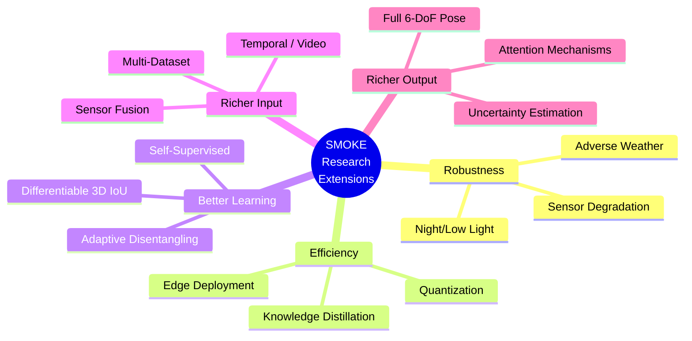

# 🎓 SMOKE Paper — Mentor Questions, Critical Reasoning & Future Research

> A structured guide for deeper understanding through discussion, critical analysis, and identifying open research problems.

---

## Table of Contents

- [Part I: Questions to Ask Your Mentor](#part-i-questions-to-ask-your-mentor)
  - [Foundational Understanding](#a-foundational-understanding)
  - [Architecture Design Choices](#b-architecture-design-choices)
  - [Loss Function Deep Dive](#c-loss-function-deep-dive)
  - [Practical & Implementation](#d-practical--implementation)
- [Part II: Critical Reasoning Questions](#part-ii-critical-reasoning-questions-you-should-be-able-to-answer)
- [Part III: "What If" Thought Experiments](#part-iii-what-if-thought-experiments)
- [Part IV: Future Research Directions](#part-iv-future-research-directions--scope-of-work)
- [Part V: Potential Thesis / Project Ideas](#part-v-potential-thesis--project-ideas)

---

# Part I: Questions to Ask Your Mentor

## A. Foundational Understanding

### Q1. Why does the 2D bounding box center ≠ projected 3D center?
> **What you already know:** SMOKE uses projected 3D center instead of 2D bbox center.  
> **Ask:** "Can you walk me through a concrete geometric example where the 2D center and projected 3D center diverge significantly? How large can this offset be in practice (pixels)?"

**Why this matters:** This is SMOKE's foundational insight. Understanding *when* and *by how much* they diverge tells you why the ablation shows +5.83 AP improvement.

---

### Q2. Why is monocular depth estimation fundamentally ill-posed?
> **Ask:** "Beyond the obvious loss of depth during projection, are there specific mathematical reasons (like the rank deficiency of the projection matrix) that make this harder than stereo depth?"

**Why this matters:** Understanding the theoretical limits of monocular depth helps you appreciate why SMOKE's depth accuracy drops at long range and why LiDAR still dominates.

---

### Q3. How does the Gaussian radius σ get computed?
> **Ask:** "The paper says σ is 'based on object size' — but what's the exact formula? Is it the IoU-based radius from CornerNet, or something SMOKE-specific?"

**Why this matters:** The radius directly controls the positive/negative ratio in the heatmap loss. Too small = too few positives (slow convergence). Too large = localization noise.

---

### Q4. Why 4× downsampling specifically?
> **Ask:** "Why does the backbone output at stride 4 (H/4 × W/4)? What happens if we use stride 2 (more spatial detail) or stride 8 (faster but coarser)?"

**Why this matters:** This is a fundamental accuracy-vs-speed tradeoff. CenterNet experimented with different strides, and SMOKE inherited stride 4 — but the justification is worth understanding.

---

## B. Architecture Design Choices

### Q5. Why DLA-34 and not a deeper backbone?
> **Ask:** "DLA-34 is relatively lightweight. Would DLA-60 or even a ResNet-101 backbone give better accuracy? Is there evidence that the bottleneck is in the backbone or in the heads?"

**Why this matters:** Knowing where the performance bottleneck lies (representation quality vs. head design vs. loss function) guides where to invest effort in improvements.

---

### Q6. Why DCNv2 only at aggregation nodes, not everywhere?
> **Ask:** "SMOKE replaces aggregation conv layers with DCNv2 but keeps regular conv in the backbone stages. What's the rationale? Is it computational cost, or do deformable convs in early layers hurt?"

**Why this matters:** DCNv2 adds learnable offsets + modulation at the cost of extra parameters. Understanding where it helps most reveals what the model struggles with (feature alignment at aggregation boundaries).

---

### Q7. Why Group Normalization instead of Batch Normalization?
> **Ask:** "The paper uses GN because of small batch sizes. But with modern GPUs allowing larger batches, would switching to BN help? What about Layer Normalization or Instance Normalization?"

**Why this matters:** Normalization choice interacts with batch size, learning rate, and convergence speed. This is a practical consideration for anyone reimplementing or extending SMOKE.

---

### Q8. Why only two conv layers per head?
> **Ask:** "Each head is just Conv(3×3) → Conv(1×1). Is this sufficient? Would a deeper head (3–4 layers) or attention mechanisms improve regression accuracy?"

**Why this matters:** The head simplicity is elegant but potentially limiting. Understanding if the backbone or head is the bottleneck shapes improvement strategies.

---

## C. Loss Function Deep Dive

### Q9. Why exactly 3 groups in disentangling? Why not 7 (one per parameter)?
> **Ask:** "MonoDIS proposed the disentangling concept. SMOKE uses 3 groups: {depth}, {offset+dims}, {angle}. Why group offset and dimensions together? What happens with 7 separate groups (one per DoF)?"

**Why this matters:** The grouping is a design choice, not a mathematical necessity. More groups = more gradient isolation but also more loss terms. Understanding the tradeoff reveals the authors' reasoning.

---

### Q10. Why L1 loss on projected corners, not 3D corners?
> **Ask:** "The disentangled loss projects 8 corners to 2D and computes L1 there. Why not compute L1 directly in 3D space? Does projecting to 2D bias the loss toward nearby objects (since they have larger projection)?"

**Why this matters:** This is a subtle design decision. 2D projection may over-penalize nearby objects (larger pixel errors) and under-penalize far ones. Understanding this limitation could inspire better loss formulations.

---

### Q11. Why no balancing weight between L_keypoint and L_reg?
> **Ask:** "The total loss is just L_keypoint + L_reg without any weighting λ. How do their magnitudes compare during training? Does one dominate early on?"

**Why this matters:** Loss balancing is a common pain point in multi-task learning. SMOKE claims the disentangling naturally balances things — testing this claim is valuable.

---

### Q12. How sensitive is α=2, β=4 in the focal loss?
> **Ask:** "These hyperparameters come from CornerNet/CenterNet. Has anyone ablated them specifically for SMOKE? Would α=3 or β=3 perform differently for 3D detection?"

**Why this matters:** Hyperparameter sensitivity tells you how robust the method is and whether there's room for tuning.

---

## D. Practical & Implementation

### Q13. How does SMOKE handle multiple overlapping objects?
> **Ask:** "If two cars are very close together, their Gaussian heatmap blobs could overlap. How does the model distinguish them? What's the failure mode?"

**Why this matters:** Overlapping/occluded objects are a major failure case. Understanding the peak extraction behavior under crowded scenes reveals practical limitations.

---

### Q14. What happens with truncated objects?
> **Ask:** "~5% of objects are discarded because their 3D center projects outside the image. Isn't this a significant limitation for objects at image edges? How do other methods handle this?"

**Why this matters:** Edge-of-image objects are common in driving (cars entering/exiting the field of view). This is an acknowledged limitation worth discussing.

---

### Q15. Why no NMS works here but fails in anchor-based methods?
> **Ask:** "SMOKE claims no NMS is needed because each object generates exactly one peak. But what about false positives — wouldn't suppression help filter those?"

**Why this matters:** The no-NMS claim is elegant but worth stress-testing. In practice, noisy heatmaps may produce spurious peaks.

---

### Q16. How does SMOKE generalize beyond KITTI?
> **Ask:** "KITTI is a specific driving dataset from Germany with specific camera parameters. How would SMOKE perform on nuScenes, Waymo Open, or non-driving scenarios? What needs to change?"

**Why this matters:** Generalization is the ultimate test of any method. KITTI-specific tuning (mean dimensions, camera intrinsics) may not transfer.

---

# Part II: Critical Reasoning Questions (You Should Be Able to Answer)

These test deep understanding — try answering them before the mentor discussion.

| # | Question | Hint |
|---|----------|------|
| 1 | Why can't you just regress the 7 DoF directly with an L2 loss? | Think about scale differences between depth (meters) and angle (radians) |
| 2 | If you remove the disentangled loss and use joint corner loss, what specifically breaks? | Gradient interference — depth gradient flowing through dimension parameters |
| 3 | Why does the inverse sigmoid for depth (`z = 1/σ(δ)`) work better than direct regression? | Gradient magnification for far objects, bounded output |
| 4 | What would happen if you used 2D box center as keypoint but kept everything else the same? | Ablation shows -5.83 AP — explain *geometrically* why |
| 5 | Why 8 corners × 2D = 16 values, not just the 7 DoF parameters for the loss? | Corner projection captures *geometric consistency* — errors in one param affect all corners differently |
| 6 | Can SMOKE detect objects behind the camera? Why or why not? | Depth is always positive (sigmoid), projection undefined for Z ≤ 0 |
| 7 | Why does SMOKE use class-specific mean dimensions (h̄, w̄, l̄)? | Anchoring the regression to reasonable values — without it, the network must learn absolute sizes from scratch |
| 8 | What happens to the heatmap if two cars have the same projected 3D center? | The Gaussians merge — the model can only detect one of them (limitation) |
| 9 | Why arctan2 and not arctan for orientation recovery? | arctan only returns [-π/2, π/2]; arctan2 returns full [-π, π] using both sin and cos |
| 10 | Does SMOKE work for pitch and roll angles? Why or why not? | It only regresses yaw — assumes flat road. Non-flat terrain breaks this assumption |

---

# Part III: "What If" Thought Experiments

These push beyond the paper and demonstrate research thinking. Discuss them with your mentor.

### Experiment 1: What if we use a transformer backbone instead of DLA-34?
> **Hypothesis:** Vision Transformers (ViT, Swin) capture global context better. Depth estimation might benefit from long-range attention (e.g., vanishing point relationships).  
> **Counter-argument:** Transformers are computationally heavier and may lose the real-time advantage (~30ms).  
> **Discussion point:** Is SMOKE's bottleneck local feature quality or global context?

### Experiment 2: What if we add a depth estimation auxiliary task?
> **Hypothesis:** A shared backbone producing both a dense depth map AND keypoint heatmap could provide richer depth supervision.  
> **Counter-argument:** Multi-task learning can hurt primary task if not carefully balanced.  
> **Discussion point:** Pseudo-LiDAR methods showed depth maps help — can we get the benefit without the full two-stage complexity?

### Experiment 3: What if we disentangle into 7 groups instead of 3?
> **Hypothesis:** Maximum gradient isolation — one group per parameter.  
> **Counter-argument:** 7 loss terms mean 7 separate corner computations per object (7× cost), and some parameters may benefit from partial entanglement (e.g., offset and depth are geometrically linked).  
> **Discussion point:** Is there an optimal grouping between 1 and 7?

### Experiment 4: What if we add temporal information (video)?
> **Hypothesis:** Consecutive frames provide motion cues for depth estimation (structure from motion). Tracking objects across frames could regularize 3D predictions.  
> **Counter-argument:** Increases latency, requires sequence modeling (LSTM/temporal conv).  
> **Discussion point:** Would a two-frame approach (stereo-from-motion) give stereo-like depth cues?

### Experiment 5: What if we replace the L1 corner loss with a differentiable 3D IoU loss?
> **Hypothesis:** L1 on corners doesn't directly optimize the evaluation metric (3D IoU). A differentiable 3D IoU loss would align training with evaluation.  
> **Counter-argument:** 3D IoU computation is complex, and differentiable approximations may be noisy.  
> **Discussion point:** GIoU and DIoU losses worked well for 2D detection — can we extend them to 3D?

---

# Part IV: Future Research Directions & Scope of Work

## 🔬 High-Impact Research Problems

### 1. Uncertainty-Aware 3D Detection
> **Problem:** SMOKE outputs point estimates — no confidence on depth, dimensions, or orientation.  
> **Research Idea:** Predict **probability distributions** for each parameter (e.g., Gaussian mean + variance). This enables:
> - Risk-aware autonomous driving decisions
> - Knowing *when not to trust* a prediction
> - Better fusion with other sensors
>
> **Key References:** Gaussian YOLO, probabilistic object detection, Monte Carlo dropout  
> **Difficulty:** ⭐⭐⭐ (Medium) — Adds variance heads and modifies loss to NLL

---

### 2. Multi-Class Multi-Dataset Generalization
> **Problem:** SMOKE is trained and evaluated on KITTI only (German driving, one camera setup).  
> **Research Idea:** Train a single model on **KITTI + nuScenes + Waymo Open** with:
> - Camera-intrinsic conditioning (different focal lengths per dataset)
> - Class-aware dimension priors across datasets
> - Domain adaptation for different driving environments
>
> **Difficulty:** ⭐⭐⭐⭐ (Hard) — Dataset alignment and domain shift are big challenges

---

### 3. Temporal SMOKE — Video-Based 3D Detection
> **Problem:** SMOKE uses single frames, ignoring temporal context.  
> **Research Idea:** Extend SMOKE with:
> - **Temporal feature aggregation** (concat/LSTM on backbone features across frames)
> - **Motion-based depth cues** (structure from motion gives depth constraints)
> - **Tracking-by-detection** (associate detections across frames)
>
> **Potential Gain:** Better depth estimation for far objects, smoother trajectories  
> **Difficulty:** ⭐⭐⭐ (Medium) — Temporal architectures are well-studied

---

### 4. Attention-Enhanced SMOKE
> **Problem:** DLA-34 with DCNv2 adapts locally but lacks global context.  
> **Research Idea:**
> - Add **self-attention layers** after the backbone (like DETR)
> - Or use a **Swin Transformer** backbone with SMOKE's heads
> - Or add **cross-attention** between the keypoint and regression branches
>
> **Why:** Depth estimation benefits from global cues (vanishing points, object relationships, scene priors)  
> **Difficulty:** ⭐⭐⭐ (Medium)

---

### 5. 3D Detection Under Adverse Conditions
> **Problem:** SMOKE (and most methods) are evaluated on clear-weather daytime data.  
> **Research Idea:** Benchmark and improve SMOKE under:
> - **Rain / Fog / Snow** (domain shift in appearance)
> - **Night / Low light** (poor feature extraction)
> - **Glare / Sun** (overexposure)
> - **Sensor degradation** (dirty lens, vibration)
>
> **Approaches:** Data augmentation, domain adaptation, test-time training  
> **Difficulty:** ⭐⭐⭐⭐ (Hard) — Data collection and robust evaluation

---

### 6. Better Loss Functions for 3D Detection
> **Problem:** L1 on projected corners doesn't directly optimize 3D IoU (the evaluation metric).  
> **Research Ideas:**
> - **Differentiable 3D IoU loss** — directly optimize what you evaluate
> - **Depth-aware loss weighting** — penalize far-object errors less (they're inherently harder)
> - **Adaptive disentangling** — learn the optimal parameter grouping instead of fixing 3 groups
> - **Contrastive loss** — push similar objects to have similar features
>
> **Difficulty:** ⭐⭐⭐ (Medium) — Loss function research is accessible and impactful

---

### 7. Lightweight SMOKE for Edge Deployment
> **Problem:** SMOKE runs at 30ms on a TITAN Xp GPU. Autonomous driving needs edge devices (Jetson, mobile).  
> **Research Idea:**
> - **Knowledge distillation** — train a smaller student model from SMOKE
> - **Pruning / quantization** — compress the DLA-34 backbone (INT8/FP16)
> - **Neural architecture search** — find an optimal lightweight backbone
> - **TensorRT optimization** — deploy on edge inference engines
>
> **Target:** < 10ms on NVIDIA Jetson Orin  
> **Difficulty:** ⭐⭐ (Easy-Medium) — well-established compression techniques

---

### 8. Fusing SMOKE with Other Sensors
> **Problem:** Monocular 3D detection has inherent depth limitations. Can we selectively fuse with cheap sensors?  
> **Research Idea:**
> - **Mono + Radar** — radar provides sparse but accurate depth; use it to calibrate SMOKE's depth predictions
> - **Mono + Ultrasonic** — short-range depth correction for near objects
> - **Mono + Low-cost LiDAR** — 1-beam or 4-beam LiDAR (< $100) for depth anchoring
>
> **Key Question:** Can we get 80% of LiDAR accuracy at 10% of the cost?  
> **Difficulty:** ⭐⭐⭐⭐ (Hard) — Sensor fusion is complex, needs hardware setup

---

### 9. Extending SMOKE to Full 6-DoF Pose on Non-Flat Terrain
> **Problem:** SMOKE assumes pitch ≈ roll ≈ 0 (flat road). Fails on hills, ramps, off-road.  
> **Research Idea:**
> - Regress **full rotation** (quaternion or 6D rotation representation instead of just yaw)
> - Add **road plane estimation** as auxiliary task
> - Use **IMU data** to provide pitch/roll prior
>
> **Difficulty:** ⭐⭐⭐ (Medium) — Rotation representation research is active

---

### 10. Self-Supervised / Semi-Supervised SMOKE
> **Problem:** 3D annotations are expensive (requires LiDAR + manual labeling).  
> **Research Idea:**
> - **Self-supervised depth** from video (monocular depth estimation without labels)
> - **Pseudo-labels** — use a trained SMOKE model to label unlabeled data, retrain
> - **Consistency regularization** — augmented views of same scene should produce same 3D boxes
> - **Sim-to-Real** — train on synthetic data (CARLA, GTA-V), adapt to real
>
> **Impact:** Dramatically reduces annotation cost  
> **Difficulty:** ⭐⭐⭐⭐⭐ (Very Hard) — Active frontier in CV research

---

## Research Scope Summary

---

# Part V: Potential Thesis / Project Ideas

| # | Title | Scope | Duration |
|---|-------|:-----:|:--------:|
| 1 | "Uncertainty-Aware Monocular 3D Detection via Disentangled Probabilistic Regression" | MS Thesis | 6–9 months |
| 2 | "Real-Time 3D Detection on Edge: Compressing SMOKE for Jetson Deployment" | Course Project | 2–3 months |
| 3 | "Temporal SMOKE: Leveraging Video Consistency for Improved Monocular 3D Detection" | MS Thesis | 6–9 months |
| 4 | "Cross-Dataset Monocular 3D Detection with Camera-Intrinsic Conditioning" | Research Paper | 4–6 months |
| 5 | "Evaluating Monocular 3D Detection Under Adverse Weather: A Benchmark Study" | Course Project | 2–3 months |
| 6 | "Learning to Disentangle: Adaptive Group Selection for 3D Regression Losses" | Workshop Paper | 3–4 months |
| 7 | "Radar-Guided Monocular 3D Detection for Cost-Effective Autonomous Driving" | PhD Topic | 12+ months |
| 8 | "Self-Supervised Monocular 3D Detection via Geometric Consistency" | PhD Topic | 12+ months |

---

> **💡 Tip for Mentor Discussions:** Don't just ask these questions — come prepared with your *own hypothesis* for each one. Say "I think X because Y — am I right?" This shows initiative and deeper engagement.
